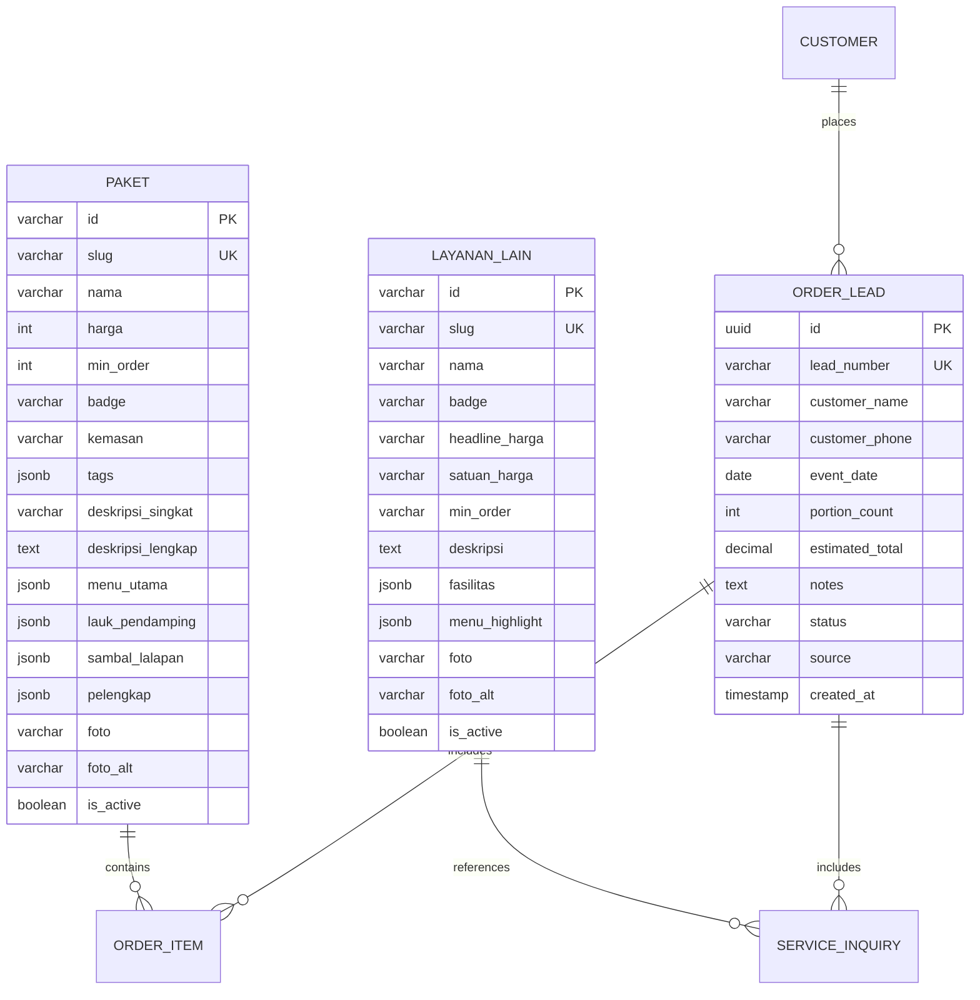
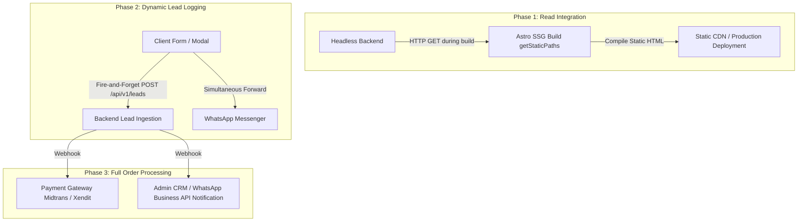

# Frontend-to-Backend Technical Handover & API Contract Specification (RFC)

**Document Version:** 1.0.0  
**Status:** PROPOSED / RFC  
**Target Audience:** Backend Engineering Team, Tech Leads, QA  
**Author:** Senior Frontend Engineer (Dzanis Catering Web)  
**Date:** September 2026  
**Repository:** `Dzanis-catering-update`

---

## I. Executive Summary & Architectural Context

### 1. Architectural Overview
The Dzanis Catering web platform is engineered with **Astro 5** utilizing **Static Site Generation (SSG)** and styled with **Tailwind CSS v4**. 

A core architectural principle of this system is **Zero-Framework Client Runtime Overhead**. Unlike traditional SPAs or hydrated Next.js/React architectures:
- The site ships **0 KB of React, Vue, Svelte, or runtime UI component bundles** to the client.
- Client interactivity relies entirely on semantic HTML5 (`<dialog>` for modals, `<details>`/`<summary>` for menu disclosures, and native input validations) paired with micro-vanilla JavaScript routines.
- Page rendering achieves near-instant First Contentful Paint (FCP) and optimal SEO performance across local search indices for the Ciayumajakuning (Cirebon, Indramayu, Majalengka, Kuningan) market.

### 2. Integration Objective
Currently, product packages, pricing tiers, and event services reside in static TypeScript files (`src/data/paket.ts`, `src/data/layananLain.ts`, `src/data/menu.ts`, `src/data/company.ts`). Order inquiries and custom portion calculations are dispatched via parameterized WhatsApp URL payloads directly to the official company contact (`6281324383858`).

The goal of this backend integration is to:
1. **Decouple Data Management**: Transition from static code-committed datasets to a headless database-backed REST API, allowing the business operations team to update menus, pricing, and availability without code deployments.
2. **Preserve SSG Performance**: Maintain build-time data ingestion via Astro's `getStaticPaths()` and server endpoints without introducing heavy client-side hydration or blocking initial page loads.
3. **Capture and Persist Customer Inquiries (Leads)**: Implement an ingestion layer to track order inquiries, drop-offs, and conversion funnels before routing users to WhatsApp.
4. **Establish Server-Authoritative Calculations**: Validate minimum order quantities (MoQ), pricing tiers, delivery radii, and cutoff times on the server to prevent tamper-prone client calculations.

---

## II. Current Data Schemas & Business Entities

The frontend codebase defines strict domain models. The proposed database design must accurately reflect these entities while accommodating future persistence needs.



---

### Entity 1: `Paket` (Nasi Kotak)
Source file: [`src/data/paket.ts`](file:///home/najib/Projek/Dzanis-catering-update/src/data/paket.ts)

This entity represents fixed-tier boxed meal catering products.

| Frontend Property | Frontend Type | Suggested DB Column | DB Data Type | Constraints & Business Rules |
| :--- | :--- | :--- | :--- | :--- |
| `id` | `string` | `id` | `VARCHAR(64)` | Primary Key (e.g., `'paket-hemat-20k'`) |
| `slug` | `string` | `slug` | `VARCHAR(64)` | Unique, Indexed, URL-friendly slug |
| `nama` | `string` | `nama` | `VARCHAR(128)` | Not Null (e.g., `'Paket Hemat 20K'`) |
| `harga` | `number` | `harga` | `INT UNSIGNED` | Unit price in IDR (e.g., `20000`) |
| `minOrder` | `number` | `min_order` | `INT UNSIGNED` | Hard constraint: `min_order >= 20` (Default: `20`) |
| `badge` | `string \| null \| undefined` | `badge` | `VARCHAR(64)` | Nullable (e.g., `'PALING SERING DIPESAN'`) |
| `kemasan` | `string` | `kemasan` | `VARCHAR(128)` | Packaging specs (e.g., `'Box Kraft 18x18 cm'`) |
| `tags` | `string[]` | `tags` | `JSONB` / `TEXT[]` | Quick filter pills (e.g., `["Nasi Pulen", "Kerupuk"]`) |
| `deskripsiSingkat` | `string` | `deskripsi_singkat` | `VARCHAR(255)` | Short excerpt displayed on catalog cards |
| `deskripsiLengkap` | `string` | `deskripsi_lengkap` | `TEXT` | Comprehensive copy for `/paket/[slug]` detail page |
| `menuUtama` | `string[]` | `menu_utama` | `JSONB` / `TEXT[]` | Core protein / primary dish options |
| `laukPendamping` | `string[]` | `lauk_pendamping` | `JSONB` / `TEXT[]` | Side dish options expandable in `<details>` |
| `sambalLalapan` | `string[]` | `sambal_lalapan` | `JSONB` / `TEXT[]` | Relishes and raw vegetables |
| `pelengkap` | `string[]` | `pelengkap` | `JSONB` / `TEXT[]` | Utensils, tissues, drinks, and crackers |
| `foto` | `string` | `foto` | `VARCHAR(255)` | Asset path or CDN URL |
| `fotoAlt` | `string \| undefined` | `foto_alt` | `VARCHAR(255)` | Accessibility alternative text |
| `ringkas` | `string \| undefined` | `ringkas` | `VARCHAR(255)` | Legacy summary string (optional) |
| `populer` | `boolean \| undefined` | `is_popular` | `BOOLEAN` | Default: `FALSE`. Highlights featured item |
| *(Audit fields)* | - | `is_active`, `created_at`, `updated_at` | `BOOLEAN`, `TIMESTAMPTZ` | Standard administrative auditing |

#### Business Rules & Constraints
1. **Minimum Order Quantity (MoQ)**: Must strictly enforce `min_order >= 20`. Any order calculation with `quantity < 20` must be rejected.
2. **Subtotal Calculation**: $\text{Subtotal} = \text{harga} \times \text{portion\_count}$.
3. **Down Payment Policy**: Standard down payment is 50% (`dpPersen = 50`), payable upon order confirmation.

---

### Entity 2: `LayananLain` (Event Catering & Additional Services)
Source file: [`src/data/layananLain.ts`](file:///home/najib/Projek/Dzanis-catering-update/src/data/layananLain.ts)

This entity represents high-scale, tailored event services (buffet, live food carts, weddings) that require consultation rather than direct checkout.

| Frontend Property | Frontend Type | Suggested DB Column | DB Data Type | Constraints & Business Rules |
| :--- | :--- | :--- | :--- | :--- |
| `id` | `string` | `id` | `VARCHAR(64)` | Primary Key (e.g., `'prasmanan-kantor'`) |
| `slug` | `string` | `slug` | `VARCHAR(64)` | Unique, Indexed (e.g., `'prasmanan-kantor'`) |
| `nama` | `string` | `nama` | `VARCHAR(128)` | Not Null (e.g., `'Prasmanan Kantor'`) |
| `badge` | `string \| null \| undefined` | `badge` | `VARCHAR(64)` | Nullable (e.g., `'POPULER UNTUK BAZAR'`) |
| `headlineHarga` | `string` | `headline_harga` | `VARCHAR(32)` | Display headline (e.g., `'Rp 45.000'`, `'Rp 3.500.000'`) |
| `satuanHarga` | `string` | `satuan_harga` | `VARCHAR(32)` | Pricing denominator (e.g., `'/ pax'`, `'/ stall (200 porsi)'`) |
| `minOrder` | `string` | `min_order` | `VARCHAR(64)` | Textual MoQ constraint (e.g., `'Min. 50 pax'`, `'Min. 1 Booth'`) |
| `deskripsi` | `string` | `deskripsi` | `TEXT` | Service overview copy |
| `fasilitas` | `string[]` | `fasilitas` | `JSONB` / `TEXT[]` | Included operational amenities (waiter, chafing dish, decor) |
| `menuHighlight` | `string[]` | `menu_highlight` | `JSONB` / `TEXT[]` | Curated sample menu items shown in native accordion |
| `foto` | `string` | `foto` | `VARCHAR(255)` | Asset path or CDN URL |
| `fotoAlt` | `string` | `foto_alt` | `VARCHAR(255)` | Image accessibility description |
| *(Audit fields)* | - | `is_active`, `created_at`, `updated_at` | `BOOLEAN`, `TIMESTAMPTZ` | Administrative auditing |

#### Business Rules & Constraints
1. **Variable Pricing**: Large-scale event catering is subject to venue fees, equipment rental durations, and logistics. No automated full payment checkout should be forced on this entity; it acts as a consultation-led funnel.
2. **MoQ Semantics**: MoQ ranges from 1 Booth up to 200 Pax depending on the tier.

---

### Entity 3: `OrderLead` (Transactions & Inquiries)
Synthesized from: [`src/components/interactive/OrderModal.astro`](file:///home/najib/Projek/Dzanis-catering-update/src/components/interactive/OrderModal.astro), [`src/pages/paket/[slug].astro`](file:///home/najib/Projek/Dzanis-catering-update/src/pages/paket/%5Bslug%5D.astro), and [`src/components/organic/LayananLain.astro`](file:///home/najib/Projek/Dzanis-catering-update/src/components/organic/LayananLain.astro).

| Attribute | DB Column | DB Data Type | Notes |
| :--- | :--- | :--- | :--- |
| Inquiry ID | `id` | `UUID` / `ULID` | Primary Key |
| Inquiry Number | `lead_number` | `VARCHAR(32)` | Human-readable tracking (e.g., `'DZ-202609-001'`) |
| Service Category | `category` | `VARCHAR(32)` | `'nasi_kotak'`, `'snack_box'`, `'layanan_lain'` |
| Item / Package Reference | `package_id` | `VARCHAR(64)` | References `Paket.id` or `LayananLain.id` |
| Package Name Snapshot | `package_name` | `VARCHAR(128)` | Captured name at time of order |
| Customer Name | `customer_name` | `VARCHAR(128)` | Required |
| Customer Phone | `customer_phone` | `VARCHAR(32)` | Normalized international format (`628...`) |
| Event Date | `event_date` | `DATE` | Must satisfy cutoff constraints |
| Portion Count | `portion_count` | `INT UNSIGNED` | Must satisfy `min_order` |
| Event Location / City | `event_location` | `VARCHAR(255)` | Delivery destination in Ciayumajakuning |
| Customer Notes | `notes` | `TEXT` | Optional specific instructions |
| Estimated Subtotal | `estimated_total` | `DECIMAL(12,2)` | Server-calculated total |
| Lead Status | `status` | `VARCHAR(32)` | `'NEW'`, `'CONTACTED'`, `'DP_PAID'`, `'COMPLETED'`, `'CANCELLED'` |
| Ingestion Channel | `source` | `VARCHAR(32)` | `'MODAL_FORM'`, `'CALCULATOR_DIRECT'`, `'WHATSAPP_LINK'` |
| Timestamps | `created_at`, `updated_at` | `TIMESTAMPTZ` | System timestamp |

---

## III. Proposed REST API Contracts (Endpoints & Payloads)

### Base URL
```
Production: https://api.dzaniscatering.com/api/v1
Staging:    https://staging-api.dzaniscatering.com/api/v1
```

---

### 1. `GET /api/v1/packages`
Retrieves all active Nasi Kotak packages. Consumed by Astro during static build generation (`getStaticPaths`) and by catalog components.

- **Method**: `GET`
- **Headers**:
  ```http
  Accept: application/json
  ```
- **Query Parameters**:
  - `active` (boolean, optional, default: `true`): Filter active items.
  - `sort` (string, optional, default: `'harga_asc'`): Sort order (`'harga_asc'`, `'harga_desc'`).

#### Success Response (`200 OK`)
```json
{
  "success": true,
  "data": [
    {
      "id": "paket-hemat-20k",
      "slug": "paket-hemat-20k",
      "nama": "Paket Hemat 20K",
      "harga": 20000,
      "minOrder": 20,
      "badge": null,
      "kemasan": "Box Kraft 18x18 cm",
      "tags": ["Nasi Pulen", "Sambal Terasi", "Kerupuk"],
      "deskripsiSingkat": "Pilihan hemat praktis untuk konsumsi pengajian, syukuran, atau rapat internal.",
      "deskripsiLengkap": "Pilihan hemat dan praktis untuk berbagai kebutuhan acara seperti pengajian, syukuran, dan rapat internal. Setiap porsi dikemas higienis menggunakan box kraft ramah lingkungan, lengkap dengan alat makan steril dan lauk pauk berkualitas yang diolah secara higienis.",
      "menuUtama": [
        "Ayam Goreng Serundeng Lengkuas",
        "Tahu & Tempe Goreng Gurih"
      ],
      "laukPendamping": [
        "Oseng Kacang Panjang Tempe",
        "Bihun Goreng Sayur",
        "Tumis Buncis Jagung",
        "Capcay Gurih"
      ],
      "sambalLalapan": [
        "Sambal Terasi Matang",
        "Lalapan Timun Segar"
      ],
      "pelengkap": [
        "Nasi Putih Pulen",
        "Kerupuk Bawang",
        "Air Mineral Cup",
        "Sendok & Tisu Steril"
      ],
      "foto": "/images/menu/paket-20k.jpg",
      "fotoAlt": "Paket Hemat 20K Dzanis Catering",
      "isPopular": false
    }
  ],
  "meta": {
    "total": 3,
    "timestamp": "2026-09-08T16:30:00Z"
  }
}
```

---

### 2. `GET /api/v1/packages/:slug`
Retrieves a single package detail by its URL slug.

- **Method**: `GET`
- **Path Parameters**:
  - `slug` (string, required): e.g., `'paket-favorit-23k'`

#### Success Response (`200 OK`)
```json
{
  "success": true,
  "data": {
    "id": "paket-favorit-23k",
    "slug": "paket-favorit-23k",
    "nama": "Paket Favorit 23K",
    "harga": 23000,
    "minOrder": 20,
    "badge": "PALING SERING DIPESAN",
    "kemasan": "Box Bento Sekat 4",
    "tags": ["Nasi Pulen", "Telur Balado 1/2", "Pisang", "Kerupuk"],
    "deskripsiSingkat": "Kombinasi dua protein dengan buah pencuci mulut, menu terfavorit untuk seminar dan instansi.",
    "deskripsiLengkap": "Pilihan terfavorit yang paling sering dipesan untuk kebutuhan seminar, workshop instansi, dan acara korporat. Mengombinasikan dua varian protein lezat dengan pelengkap buah pisang segar serta disajikan rapi dalam kemasan bento bersekat higienis.",
    "menuUtama": [
      "Ayam Bakar Madu / Ayam Goreng Lengkuas",
      "Telur Balado 1/2 Butir"
    ],
    "laukPendamping": [
      "Bakmi Goreng Gurih",
      "Capcay Bakso Sayur",
      "Sambal Goreng Kentang",
      "Tempe Orek Manis Gurih"
    ],
    "sambalLalapan": [
      "Sambal Bajak / Sambal Terasi",
      "Lalapan Segar"
    ],
    "pelengkap": [
      "Nasi Putih Pulen",
      "Buah Pisang Segar",
      "Kerupuk Renyah",
      "Air Mineral Cup",
      "Sendok & Tisu Steril"
    ],
    "foto": "/images/menu/paket-23k.jpg",
    "fotoAlt": "Paket Favorit 23K Dzanis Catering",
    "isPopular": true
  }
}
```

#### Error Response (`404 Not Found`)
```json
{
  "success": false,
  "error": {
    "code": "PACKAGE_NOT_FOUND",
    "message": "Paket katering dengan slug 'paket-tidak-ditemukan' tidak terdaftar."
  }
}
```

---

### 3. `GET /api/v1/services`
Retrieves event catering services and live stalls (Prasmanan, Booth / Food Cart, Catering Acara & Pernikahan).

- **Method**: `GET`

#### Success Response (`200 OK`)
```json
{
  "success": true,
  "data": [
    {
      "id": "prasmanan-kantor",
      "slug": "prasmanan-kantor",
      "nama": "Prasmanan Kantor",
      "badge": null,
      "headlineHarga": "Rp 45.000",
      "satuanHarga": "/ pax",
      "minOrder": "Min. 50 pax",
      "deskripsi": "Menu prasmanan lengkap untuk rapat kerja, pelatihan, seminar, dan syukuran kantor.",
      "fasilitas": [
        "Meja & Pemanas (Chafing Dish)",
        "Piring Keramik & Sendok Garpu",
        "1 Staff Waiter Stand-by"
      ],
      "menuHighlight": [
        "Nasi Putih & Nasi Goreng Mentega",
        "Daging Lada Hitam / Rolade",
        "Ayam Teriyaki / Rica",
        "Sup Kimlo Segar",
        "Puding Cup & Buah Potong"
      ],
      "foto": "/images/layanan/prasmanan-kantor.webp",
      "fotoAlt": "Layanan Prasmanan Kantor Dzanis Catering"
    },
    {
      "id": "booth-food-cart",
      "slug": "booth-food-cart",
      "nama": "Booth / Food Cart",
      "badge": "POPULER UNTUK BAZAR",
      "headlineHarga": "Rp 3.500.000",
      "satuanHarga": "/ stall (200 porsi)",
      "minOrder": "Min. 1 Booth",
      "deskripsi": "Gerai makanan live-serving untuk memeriahkan festival, bazar, ulang tahun, dan gathering komunitas.",
      "fasilitas": [
        "1 Unit Gerobak Kayu Tematik",
        "1 Staff Operator Siap Saji (3-4 Jam)",
        "Mangkok / Paper Bowl Ramah Lingkungan"
      ],
      "menuHighlight": [
        "Bakso Sapi Malang Komplit",
        "Siomay Bandung Bumbu Kacang",
        "Zuppa Soup Hangat Puff Pastry",
        "Dimsum Kukus 4 Varian"
      ],
      "foto": "/images/layanan/food-cart.webp",
      "fotoAlt": "Booth dan Food Cart Live Serving Dzanis Catering"
    }
  ]
}
```

---

### 4. `POST /api/v1/orders/calculate`
Calculates official order pricing, enforces minimum portion validation, checks cutoff availability, and calculates required down payments.

- **Method**: `POST`
- **Headers**:
  ```http
  Content-Type: application/json
  Accept: application/json
  ```

#### Request Body Schema
```json
{
  "packageSlug": "paket-favorit-23k",
  "portionCount": 75,
  "eventDate": "2026-10-15",
  "deliveryArea": "Majalengka"
}
```

| Field | Type | Required | Validation Rules |
| :--- | :--- | :--- | :--- |
| `packageSlug` | `string` | Yes | Must exist in active database packages |
| `portionCount` | `integer` | Yes | Must be $\ge \text{minOrder}$ (minimum 20) |
| `eventDate` | `string` (YYYY-MM-DD) | Yes | Must be at least $H-2$ in the future ($H-7$ if portions $> 200$) |
| `deliveryArea` | `string` | No | Target region (default: `'Majalengka'`) |

#### Success Response (`200 OK`)
```json
{
  "success": true,
  "data": {
    "package": {
      "id": "paket-favorit-23k",
      "nama": "Paket Favorit 23K",
      "unitPrice": 23000
    },
    "calculation": {
      "portionCount": 75,
      "baseSubtotal": 1725000,
      "estimatedDeliveryFee": 0,
      "grandTotal": 1725000,
      "requiredDownPayment": 862500,
      "dpPercentage": 50
    },
    "logistics": {
      "eventDate": "2026-10-15",
      "cutoffStatus": "VALID",
      "daysUntilEvent": 37,
      "deliveryArea": "Majalengka",
      "serviceCoverage": "IN_COVERAGE"
    }
  }
}
```

#### Validation Error Response (`422 Unprocessable Entity`)
```json
{
  "success": false,
  "error": {
    "code": "VALIDATION_FAILED",
    "message": "Validasi pesanan katering gagal.",
    "details": [
      {
        "field": "portionCount",
        "rule": "min_order",
        "message": "Jumlah porsi untuk Paket Favorit 23K minimal 20 box. Diterima: 12."
      },
      {
        "field": "eventDate",
        "rule": "cutoff_exceeded",
        "message": "Pemesanan harus dilakukan minimal H-2 sebelum acara (Cutoff berlaku)."
      }
    ]
  }
}
```

---

### 5. `POST /api/v1/leads`
Ingests a customer inquiry before routing to WhatsApp. Allows the business to track customer leads even if the user drops off before sending the message in WhatsApp.

- **Method**: `POST`
- **Headers**:
  ```http
  Content-Type: application/json
  Accept: application/json
  ```

#### Request Body Schema
```json
{
  "source": "MODAL_FORM",
  "category": "nasi_kotak",
  "packageSlug": "paket-favorit-23k",
  "customerName": "Ibu Rina Wijaya",
  "customerPhone": "081234567890",
  "eventDate": "2026-10-15",
  "portionCount": 50,
  "eventLocation": "Kertajati, Majalengka",
  "notes": "Tolong ayam dibakar manis gurih, sambal dipisah.",
  "estimatedTotal": 1150000
}
```

#### Success Response (`201 Created`)
```json
{
  "success": true,
  "data": {
    "leadId": "9b1deb4d-3b7d-4bad-9bdd-2b0d7b3dcb6d",
    "leadNumber": "DZ-202609-0142",
    "status": "NEW",
    "createdAt": "2026-09-08T16:35:10Z",
    "whatsappRedirectUrl": "https://wa.me/6281324383858?text=Halo%20Dzanis%20Catering%2C%20saya%20ingin%20memesan%20*Paket%20Favorit%2023K*..."
  }
}
```

#### Error Response (`400 Bad Request`)
```json
{
  "success": false,
  "error": {
    "code": "INVALID_PAYLOAD",
    "message": "Payload permintaan tidak lengkap atau format nama tidak valid."
  }
}
```

---

## IV. Frontend Edge Cases & Validation Requirements for Backend

To ensure defensive operation, the backend must guard against the following client-side edge cases:

### 1. Quantity Clamping & Defensive Minimum Orders
- **Frontend Behavior**: The client calculator in [`src/pages/paket/[slug].astro`](file:///home/najib/Projek/Dzanis-catering-update/src/pages/paket/%5Bslug%5D.astro#L340-L347) and modal in [`src/components/interactive/OrderModal.astro`](file:///home/najib/Projek/Dzanis-catering-update/src/components/interactive/OrderModal.astro#L91-L96) auto-clamps blank or `< minOrder` inputs to `minOrder = 20`.
- **Backend Requirement**: The backend must **NEVER** trust client calculations. If a request reaches `POST /api/v1/orders/calculate` or `POST /api/v1/leads` with `portionCount < package.minOrder`, the server must reject it with HTTP `422 Unprocessable Entity`.

### 2. Operational Cutoff Windows
- **Business Rule**:
  - Regular Orders ($\le 200$ box): Minimum **H-2** or **H-3** before the event.
  - Bulk Orders ($> 200$ box): Minimum **H-7** before the event to ensure kitchen labor and fresh ingredients can be allocated.
- **Backend Requirement**: Compute $\Delta t = \text{eventDate} - \text{currentDate}$ based on Western Indonesia Time (**WIB / Asia/Jakarta, UTC+7**). If $\Delta t < 2\text{ days}$ (or $< 7\text{ days}$ for $> 200$ box), flag as `CUTOFF_EXCEEDED` or mark lead as `HIGH_PRIORITY_URGENT`.

### 3. Strict Input Sanitization & Anti-Abuse
- **Customer Notes & Names**:
  - Reject or strip raw HTML, markdown injection, and SQL/NoSQL vectors (`<script>`, `javascript:`, etc.).
  - Enforce maximum lengths: `customerName` (max 128 chars), `notes` (max 1,000 chars).
- **Phone Number Normalization**:
  - Automatically normalize Indonesian mobile formats:
    - Input: `081324383858` $\rightarrow$ Normalized: `6281324383858`.
    - Input: `+62 813-2438-3858` $\rightarrow$ Normalized: `6281324383858`.
- **Rate Limiting**:
  - Apply IP-based and session-based rate limits to `POST /api/v1/leads` (e.g., maximum 5 lead submissions per 10 minutes per IP) to prevent spamming WhatsApp triggers.

### 4. Operational Delivery Coverage (Ciayumajakuning)
- **Target Coverage**: Majalengka, Cirebon (Kota & Kabupaten), Indramayu, and Kuningan.
- **Backend Requirement**: For locations explicitly outside these regencies, respond with an advisory flag `out_of_coverage: true`, indicating to the customer that customized long-distance logistics fees apply.

---

## V. Migration Strategy (Phased Rollout)

To achieve zero downtime and prevent performance regressions, we recommend executing the integration in three structured phases:



### Phase 1: Read Integration (Zero Client Overhead)
- **Implementation**:
  - In [`src/pages/paket/[slug].astro`](file:///home/najib/Projek/Dzanis-catering-update/src/pages/paket/%5Bslug%5D.astro#L8-L13), replace the static `DAFTAR_PAKET.map()` import inside `getStaticPaths()` with a build-time HTTP call:
    ```typescript
    const API_BASE_URL = import.meta.env.API_BASE_URL || 'https://api.dzaniscatering.com/api/v1';

    export async function getStaticPaths() {
      try {
        const res = await fetch(`${API_BASE_URL}/packages`);
        const { data: packages } = await res.json();
        return packages.map((paket) => ({
          params: { slug: paket.slug },
          props: { paket },
        }));
      } catch (error) {
        console.warn('Backend unavailable, falling back to local dataset:', error);
        return DAFTAR_PAKET.map((paket) => ({
          params: { slug: paket.slug },
          props: { paket },
        }));
      }
    }
    ```
- **Benefits**:
  - Zero hydration added to client.
  - Built-in fallback resilience (falls back to local TypeScript data if the backend is down during CI/CD build).

### Phase 2: Dynamic Lead Logging
- **Implementation**:
  - In [`src/components/interactive/OrderModal.astro`](file:///home/najib/Projek/Dzanis-catering-update/src/components/interactive/OrderModal.astro) and [`src/pages/paket/[slug].astro`](file:///home/najib/Projek/Dzanis-catering-update/src/pages/paket/%5Bslug%5D.astro), dispatch a background `fetch()` or `navigator.sendBeacon()` to `POST /api/v1/leads` immediately before opening the WhatsApp URL:
    ```javascript
    // Fire-and-forget lead recording
    fetch('/api/v1/leads', {
      method: 'POST',
      headers: { 'Content-Type': 'application/json' },
      body: JSON.stringify(leadData),
      keepalive: true, // Ensures request completes even if page navigates
    }).catch((err) => console.error('Lead tracking error:', err));

    // Direct user to WhatsApp
    window.open(waUrl, '_blank', 'noopener,noreferrer');
    ```
- **Benefits**:
  - Prevents customer drop-off loss.
  - Zero impact on checkout speed.

### Phase 3: Full Order Processing & Automated Notifications
- **Implementation**:
  - Introduce an administrative dashboard for the Dzanis operations team.
  - Implement automated customer notification triggers via official WhatsApp Business API upon lead submission.
  - Add optional 50% down-payment checkout link integration (e.g., Midtrans Snap / Xendit Invoice) directly inside the inquiry confirmation response.

---

## VI. Sign-Off & Open RFC Questions for Backend Team

1. **Database Selection**: We propose PostgreSQL with native `JSONB` support for complex sub-menu arrays (`menuUtama`, `laukPendamping`, `fasilitas`). Does the infrastructure team have any constraints against Postgres?
2. **Media Storage**: Product images are currently served from `/public/images/menu/` and `/public/images/layanan/`. When images are managed via backend CMS, what is the preferred CDN/S3 bucket URL structure?
3. **Build Webhook**: Can the backend emit a deployment webhook (e.g., Cloudflare Pages / Vercel deploy hook) whenever a package price or menu item is updated in the database?

---

*Report compiled by the Frontend Engineering Team for Dzanis Catering Web.*
